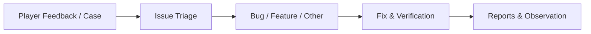
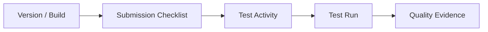
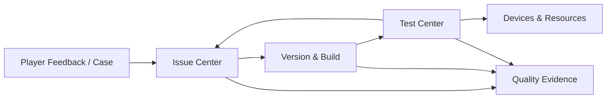

# Game Quality Hub Demo

这是一个面向游戏 QA 与研发协作场景的本地交互式质量管理中台 Demo，将玩家反馈、Issue 分诊、版本与 Build、测试执行以及设备和账号资源管理连接到统一业务状态中。

## Overview

游戏质量信息常分散在社区反馈、缺陷列表、版本记录、测试结果和资源台账中。Game Quality Hub 以共享领域模型串联这些信息，让 QA 能从反馈证据出发完成分诊，在版本与 Build 上组织检查和测试，并从同一份状态中查看质量证据。

Demo 聚焦四个模块之间的真实前端联动。所有示例数据均可本地操作、持久化和重置；外部渠道、模型、CI 与发布系统使用明确标识的模拟信息，不冒充真实接入。

## Core Workflows

### Online Feedback Flow



Case 保存原始反馈与来源证据，Issue 承载正式分类、优先级、负责人、状态和处理历史。AI 建议与人工结论分别保存，报告只使用可追溯的业务记录计算事实。

### Release Quality Flow



检查实例与测试执行保存创建时的模板或用例快照，后续编辑源模板、源用例不会改写历史记录。

## Modules

### Issue Center

- 统一接收自动采集、手工单条、批量粘贴和模板 Excel 导入的 Case。
- 保留原文、来源、附件元数据、AI 建议、人工标签和 Issue 关联。
- 支持 Issue / Bug 分诊、状态历史、Case 合并关联、趋势概览与日报／周报导出。
- Bug 是 `Classification = Bug` 的 Issue，并补充模块、Severity、Assignee 和复现信息。

### Version Management

- 按游戏与平台查看 Version、Build、范围、缺陷和质量上下文。
- 通过模板创建提测检查实例，保存模板快照、提测对象、关键项和处理记录。
- 支持本地模拟 AI 检查建议、人工接受／编辑／忽略、逐项完成或填写原因后跳过。

### Test Center

- 管理分游戏、分平台的测试用例，支持 CRUD 和需人工确认的模拟 AI 草稿。
- 发起测试活动并保存用例快照，按“用例 × 平台”记录通过、失败、阻塞或未执行。
- 展示总进度、平台进度和结果统计，并导出 Markdown／CSV 报告。

### Devices & Resources

- 管理测试设备和测试账号，以容量月历和日期分组查看可用、预约、占用与离线状态。
- 支持全局搜索、预约、借出、归还、个人占用、超期筛选和催还清单导出。
- 同一资源的重叠预约会被拦截；Reset Demo 可恢复确定性的资源分布。

## Architecture



应用基于 Next.js App Router。业务组件通过单一 Zustand Store 读写 TypeScript 领域对象，Seed Data 提供可复现的初始状态，LocalStorage Persist 保存本地操作。完整说明见 [Architecture](docs/ARCHITECTURE.md)。

## Data & State

- TypeScript 领域模型定义 Case、Issue、Version、Build、Test Case、Test Activity、Test Run、检查实例和资源记录。
- Zustand Store 统一承载跨页面业务状态与业务动作。
- LocalStorage 只持久化本 Demo 的状态，存储键为 `game-quality-hub-demo-v23`。
- Seed Data 可重复生成同一演示场景；`Reset Demo` 只恢复本应用数据。
- Test Run 保存用例快照，检查实例保存模板快照，历史记录不随源对象编辑而变化。

## Simulated AI

Demo 中的 Case 分类、标签建议、Issue 匹配、测试用例草稿、提测检查建议和报告解释采用本地确定性规则模拟，用于呈现 AI 辅助工作流与人工确认机制，不依赖外部模型或 API。AI 建议不会替代人工最终判断，报告事实来自业务状态计算。

## Tech Stack

- Next.js 16.3.5
- React 19.2.4
- TypeScript 5.7
- Zustand 5
- Tailwind CSS 4
- shadcn/ui / Base UI
- Node.js 22 / npm

## Quick Start

如果目的只是运行和体验 Demo，请使用稳定的 Production 启动方式：

```bash
npm install
npm run build
npm run start
```

然后打开 [http://localhost:3000/dashboard](http://localhost:3000/dashboard)。本机体验时请始终优先使用 `localhost`，不要自动选择局域网 IP 或 Network URL。

## Environment Requirements

- Recommended Node.js: 22（项目提供 `.nvmrc`）
- npm（默认包管理器）
- 现代浏览器

如果系统尚未安装 Node.js，请先安装 Node.js 22 或兼容版本，再执行 Quick Start 中的 npm 命令。

项目不需要 Docker、数据库、`.env`、API Key、AI / LLM API、外部渠道账号、登录系统、后端业务服务或 Git / CI Runner。

## For AI Coding Tools

如果用户的目标只是运行和评审 Demo：

1. 优先使用 npm。
2. 确认 Node.js 22 可用；若未安装，先安装 Node.js 22 或兼容版本。
3. 执行 `npm install`。
4. 执行 `npm run build`。
5. 执行 `npm run start`。
6. 打开 `http://localhost:3000/dashboard`。
7. 优先使用 `localhost`，不要使用 LAN IP 或开发预览地址。
8. 仅在修改源代码时使用 `npm run dev`。

## Development Mode

开发者需要修改代码并使用热更新时：

```bash
npm install
npm run dev
```

开发模式不是客户或评审体验 Demo 的默认启动方式。

## Bun Fallback

Bun 仍可作为备用方案：

```bash
bun install --frozen-lockfile
bun run build
bun run start
```

普通用户与 AI Coding Agent 应优先采用上面的 npm Quick Start。

## Main Routes

| Route | Purpose |
| --- | --- |
| `/dashboard` | 工作台 Launcher、全局搜索与继续处理 |
| `/dashboard/cases` | Issue Center 概览 |
| `/dashboard/cases/manage` | Case 工作台 |
| `/dashboard/cases/issues` | Issue / Bug 分诊 |
| `/dashboard/cases/reports` | 玩家反馈报告 |
| `/dashboard/projects` | Version / Build 总览 |
| `/dashboard/projects/checklists` | 提测检查实例与模板 |
| `/dashboard/tests` | 测试用例库 |
| `/dashboard/tests/runs` | 测试执行 |
| `/dashboard/tests/reports` | 测试结果与报告 |
| `/dashboard/resources` | 设备与账号资源调度 |

## Demo Scope

这是一个浏览器内运行的交互 Demo：

- 无数据库、业务后端 API、鉴权或多人实时协作；
- 无真实渠道、外部 AI API、Git / CI Runner 或云部署依赖；
- 模拟外部事件和 AI 建议均有明确边界；
- 页面状态、跨模块联动、导出和历史快照在本地完成；
- 测试失败转 Issue、失败项重跑比较和生产级发布 Gate 不属于当前可运行闭环。

## Documentation

- [Product](docs/PRODUCT.md)
- [Design](docs/DESIGN.md)
- [Architecture](docs/ARCHITECTURE.md)
- [Verification](docs/VERIFICATION.md)

## License / Attribution

The UI foundation is based on [Kiranism/next-shadcn-dashboard-starter](https://github.com/Kiranism/next-shadcn-dashboard-starter) and follows its MIT license. See [LICENSE](LICENSE).
