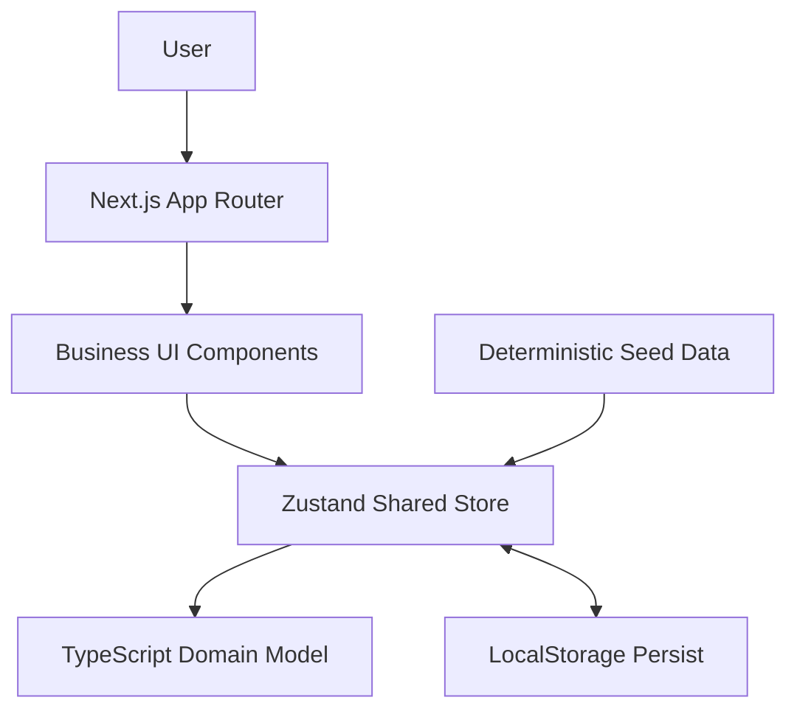
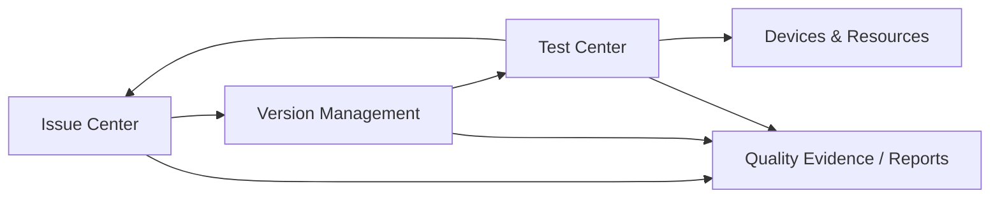
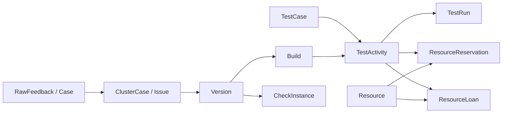

# Architecture

## Architecture Overview



应用是浏览器内运行的 Next.js 前端。App Router 提供页面入口，业务组件通过统一 Store 读取和修改领域状态。Seed Data 初始化可复现的业务场景，Zustand Persist 将用户操作保存到 LocalStorage。

## Module Map



- Issue Center 管理反馈证据、Case、Issue、Bug 分诊和反馈报告。
- Version Management 提供 Version / Build 上下文和提测检查实例。
- Test Center 管理用例、测试活动、执行快照和结果报告。
- Devices & Resources 管理设备、账号、预约、借还和占用冲突。

模块共享同一份业务状态。列表、详情、工作台指标和报告由相同领域对象派生，避免页面各自维护不一致的副本。

## Core Domain Relationships



`RawFeedback` 保存 Case 原文、来源、AI 建议和人工确认；`ClusterCase` 表示持续跟踪的 Issue。Bug 作为 Issue 的一种正式 Classification 存在，领域模型中的独立 `Bug` 结构仅用于版本上下文中的既有示例数据。

Version 聚合平台 Build、检查实例和质量上下文。Test Activity 选择用例和目标构建，每次 Test Run 保存按平台展开的执行结果。资源预约和借用可选关联 Test Activity。

## State Management

- 单一 Zustand Store 统一实现 Case 关联、Issue 分诊、检查处理、测试执行和资源调度动作。
- `persist` 中间件将业务状态保存到 `game-quality-hub-demo-v23`，刷新页面后继续使用同一状态。
- `Reset Demo` 调用确定性的 Seed Data 生成器恢复初始状态，不清除其他 LocalStorage 数据。
- Case 与 Issue 关联变化后，反馈数量、首次／最近出现时间等派生字段从真实关联重新计算。
- 列表、详情、工作台和报告直接订阅或计算共享状态，避免同步多份页面状态。

## Snapshot Design

测试活动发起时，所选 Test Case 会复制为 `TestCaseSnapshot` 并写入执行结果；之后编辑或删除用例，不会改变历史 Test Run 中的标题、步骤、预期、优先级与平台。

提测检查实例创建时，会复制模板分组和检查项为 `templateSnapshot`，并生成独立的实例检查项。模板后续编辑或删除不会改写历史实例，人工接受的 AI 建议和人工新增项也作为实例记录保存。

## AI Simulation Layer

- AI 分类、标签、匹配、用例草稿和检查建议由本地确定性规则生成。
- 相同输入产生稳定建议，便于演示与复现。
- 建议状态和人工最终结论分别保存；只有人工确认后的业务字段进入正式统计口径。
- 应用不调用外部模型服务，也不把模拟结果描述成真实推理或真实执行。
- 报告中的数量、状态和通过率由 Store 中的业务记录计算，AI 只提供说明性建议。

## Runtime Boundary

```text
Browser only
No database
No authentication
No backend business API
No external AI API
No real channel integration
No real CI runner
No cloud deployment dependency
```

这些边界让 Demo 可以在没有账号和外部基础设施的环境中复现，同时也意味着它不是生产部署方案。
